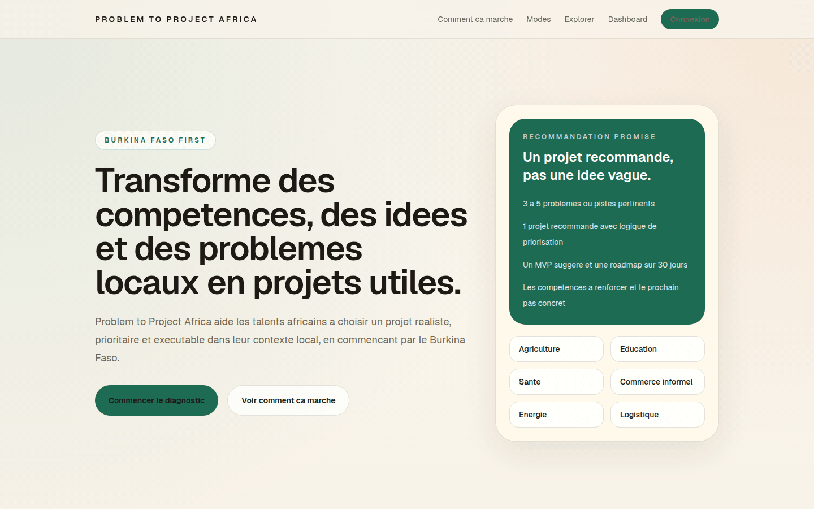
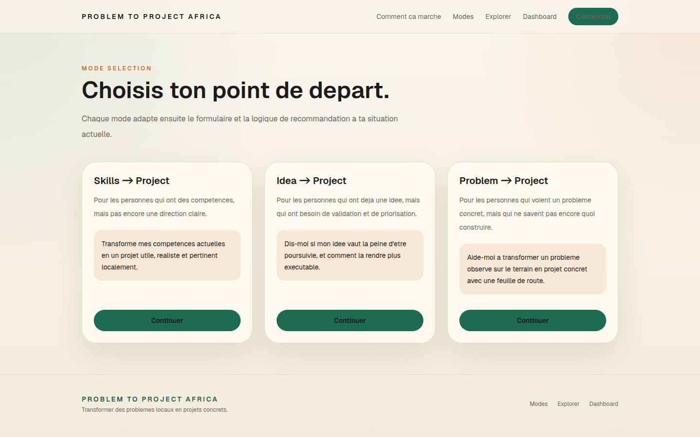
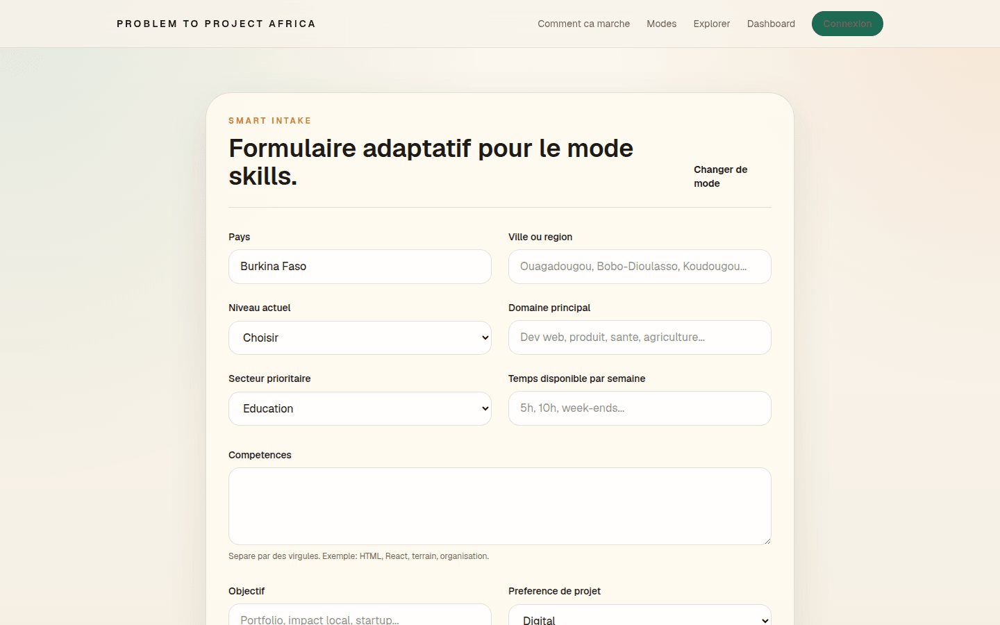
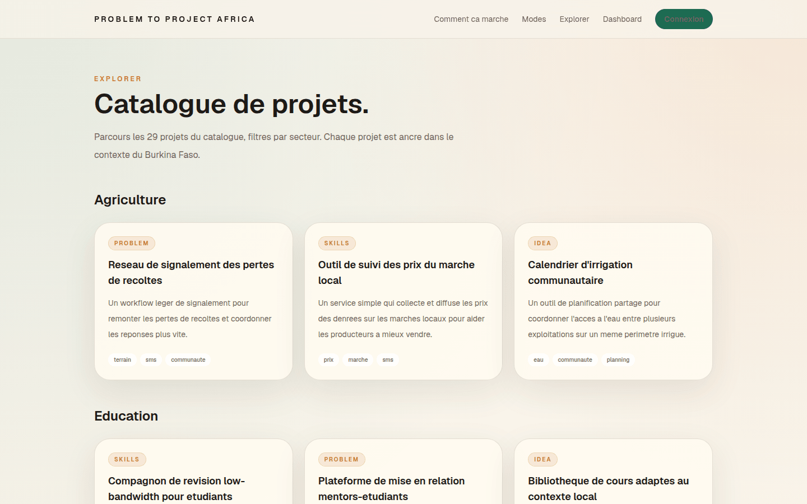

<div align="center">

# 🌍 Problem to Project Africa

*Transformer des compétences, des idées et des problèmes locaux en projets réalisables*

[](https://nextjs.org)
[](https://react.dev)
[](https://www.typescriptlang.org)
[](https://supabase.com)
[](.github/workflows/ci.yml)

</div>

---

## À propos

La plupart des outils d'idéation produisent des idées hors sol : « lance une marketplace », sans capital de départ, sans marché local, sans étape suivante. Problem to Project Africa part de l'inverse — ce que la personne a déjà — et produit un projet situé, chiffré en francs CFA, avec une feuille de route à trente jours.

Le contexte de référence est le Burkina Faso : coûts de démarrage par secteur, démarches administratives, marges observées.

### Trois portes d'entrée

| Mode | Point de départ | Ce que l'outil produit |
|---|---|---|
| **Problème** | Un problème constaté autour de soi | Une solution viable, dimensionnée au capital disponible |
| **Idée** | Une idée déjà en tête | Une validation, un budget, un seuil de rentabilité |
| **Compétences** | Un savoir-faire | Les projets qui le valorisent le mieux localement |

Chaque parcours rend une analyse financière, une carte des risques, une feuille de route par phases et un guide d'action.

---

## Aperçu

Captures générées depuis l'application réelle — voir `scripts/captures.mjs`.

### Accueil



### Choix du mode



### Questionnaire adaptatif

Les questions posées dépendent du mode et des réponses précédentes.



### Explorer



---

## Stack

```
Framework  : Next.js 16 (App Router) + React 19
Langage    : TypeScript 5, mode strict
Styles     : Tailwind CSS v4
Base       : Supabase (Postgres + Auth)
Graphiques : Recharts
Tests      : Vitest + Testing Library
```

Le moteur de recommandation est **local et déterministe** : des règles et des données sectorielles, pas d'appel à un modèle de langage. C'est un choix assumé — le résultat est reproductible, explicable et gratuit à produire.

---

## Démarrer

**Prérequis :** Node.js 22+

```bash
git clone https://github.com/dosteeve2-hash/Problem-to-Projects-Africa.git
cd Problem-to-Projects-Africa
npm ci
npm run dev
```

L'application démarre **sans configuration**. Le diagnostic, les recommandations et l'exploration fonctionnent hors ligne ; seules l'authentification et la sauvegarde d'historique demandent Supabase.

### Avec Supabase

```bash
cp .env.example .env.local
```

| Variable | Rôle |
|---|---|
| `NEXT_PUBLIC_SUPABASE_URL` | URL du projet |
| `NEXT_PUBLIC_SUPABASE_ANON_KEY` | Clé publique |

Les migrations sont dans `supabase/migrations`.

### Scripts

| Commande | Rôle |
|---|---|
| `npm run dev` | Serveur de développement |
| `npm run build` | Build de production |
| `npm run lint` | ESLint |
| `npm run typecheck` | `tsc --noEmit` |
| `npm test` | Vitest |

La CI exécute les quatre derniers sur chaque pull request.

---

## Prochaines étapes

- [ ] Persister les sessions de recommandation et les projets sauvegardés
- [ ] Routes dédiées pour le détail d'un projet et sa feuille de route
- [ ] Historique du tableau de bord branché sur des données réelles
- [ ] Contenu sectoriel réellement différencié dans les générateurs de feuille de route

---

<div align="center">

**[Steve Donald Compaoré](https://steeve-portfolio-mocha.vercel.app)** · [docompaore2@gmail.com](mailto:docompaore2@gmail.com)

*FORGE Afrika*

</div>
